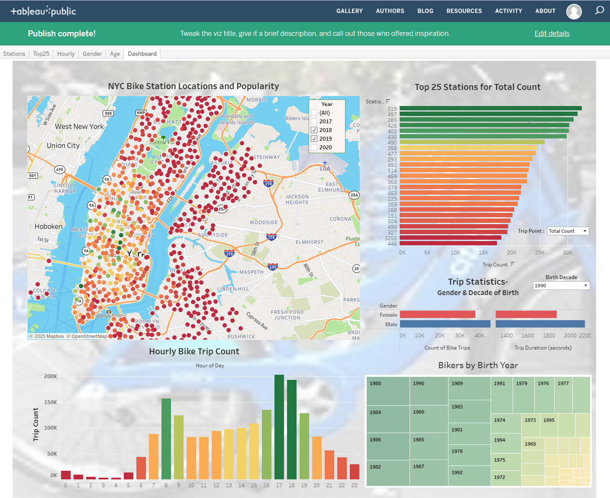
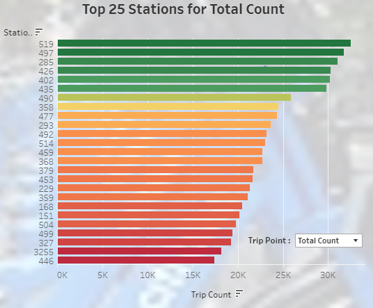

https://public.tableau.com/views/NYCBikeStations/Dashboard?:language=en&:display_count=y&publish=yes&:origin=viz_share_link

<html>

            
<body>

<h2>NYC Public Bicycle System Dashboard - with user interactivity</h2>
The project provides a visualization of NYC Public Bicycle System data utilizing Tableau Public, Mapbox, and deployed utilizing Tableau Public at: <a href="https://public.tableau.com/views/NYCBikeStations/Dashboard?:language=en&:display_count=y&publish=yes&:origin=viz_share_link">NYC Bicycle Dashboard.</a> 

<kbd></kbd>
  
<h3>Data</h3>
Data is sourced from the [Citi Bike Data](https://www.citibikenyc.com/system-data) webpage.</a>

The data .csv file was read into a [Jupyter Notebook.](/Data_Cleaning.ipynb).  Python code was used for data manipulation.  The file in raw form is too large for Tableau public. 

After three .csvs were imported into Tableau Public they were linked together using "Year".  "Year" was selected as it would be a global filter for the dashboard.

<h3>Dashboard</h3>
Five worksheets each have a visualization. The visualizations are brought together on the dashboard.  The main filter is to retrieve data for each year. It is important to note that because of the limit on file size the data is the month of June for each year.  While trends are accurate individual counts are not.

<kbd></kbd>

The "Top 25" visualization has a unique filter that allows the user to select the most popular stations to start a trip from or the most popular stations to end a trip at.  Hovering over the bars displays a tooltip describing the station's address.

<kbd></kbd>
  

<kbd></kbd>&nbsp;&nbsp;<kbd></kbd>

<kbd></kbd>

Users may view code at the following links:

To view the Jupyter Notebook's code: [Python Code](/Data_Cleaning.ipynb)   
To view the data .csvs: [.csvs](/Resources)                       

</body>
</html>
